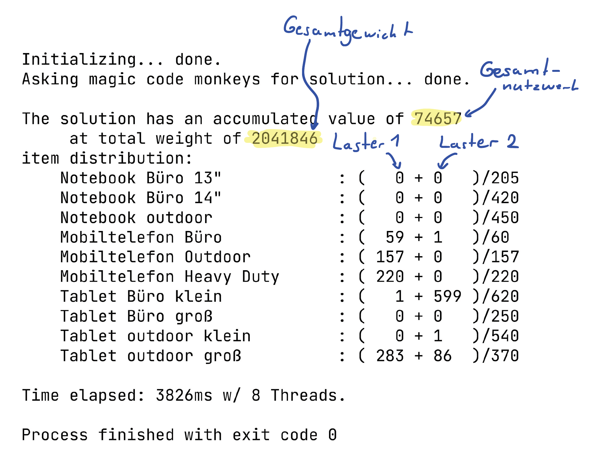

# bwi-challenge

## Installation und Ausführung
Nachdem das Repository geclont wurde, kann das Progamm wie folgt kompiliert werden: 
`mkdir out` 
`javac -d out/ src/*.java`

Wenn erfolgreich kompiliert wurde, kann das Programm wie folgt ausgeführt werden: 
`java -Xmx3072m -cp out Main`

## Wahl des Algorithmus
Das Problem ist eine leichte Abwandlung eines ***"Multiple Knapsack Problems"***. 
Die exakte Lösung hierzu zu berechnen ist mit einer solchen Anzahl an items nicht (in vernünfitger Zeit) möglich. 
Deswegen wurde das Problem hier unterteilt in einfache Knapsack Probleme, die mit einer Abwandlung des allgemeinen Lösungsansatzes gelöst werden.

## Optimale Verteilung

